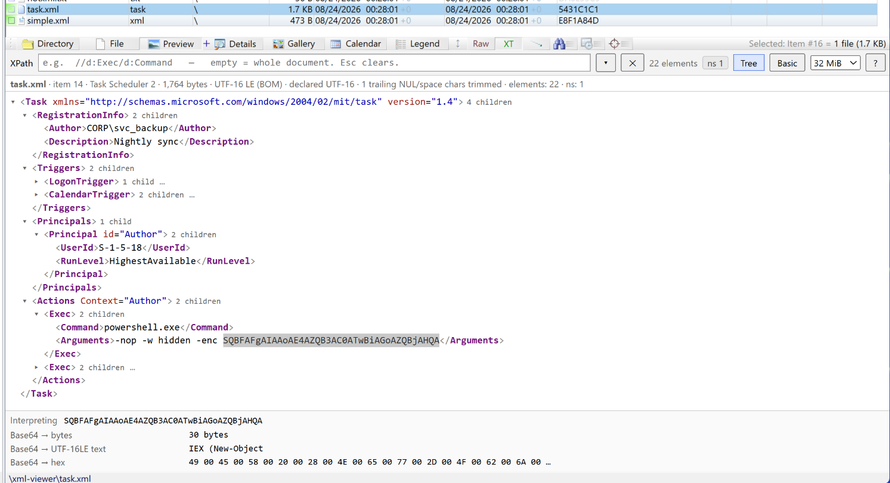

# xways-xml-viewer

Viewer X-Tension for X-Ways Forensics: a live **XPath query box and collapsible
tree** over XML files in the Preview pane, a colour-coded **Basic** view for
reading, and a **value interpreter** that decodes timestamps, Base64 and hex
from whatever is selected.

> **Status: 0.3.0-beta** — pre-release. Interfaces and output format may change
> until the first non-`-beta` release.



## Features

### Which files it claims

- X-Ways type description containing `XML`, or one of these extensions:
  `.xml .plist .svg .manifest .xaml .xsd .xsl .xslt .rdf .rss .atom .kml .gpx
  .xcu .xcs .resx .csproj .vcxproj .props .targets .nuspec .config .rels .dtd
  .wsdl .xhtml .opml .mxml .dita .xib .storyboard`.
- Text-typed items whose content starts with `<?xml`, `<!` or an element tag.
- Everything else is declined so the next viewer in the list gets it.

### XPath

- XPath 1.0, evaluated by the browser engine (`DOMParser` + `document.evaluate`)
  — no third-party JavaScript. Re-runs as you type (150 ms debounce); Enter
  forces, Esc clears.
- Namespaces are collected from the document. The default namespace is bound
  to `d:` (`//d:Exec/d:Command`); declared prefixes work as-is (`//w:t`);
  `//*[local-name()='X']` works regardless. The `ns` badge shows what was
  found.
- `?` opens a cheat sheet of XPath idioms for scheduled tasks, EVTX exports,
  plists, Office parts and manifests.
- Results: node-sets are listed as hits with their absolute XPath; strings,
  numbers and booleans are shown as values.
- Query history (`▾`): every query that returns data is saved with the file it
  ran on, most recent 50, persisted in the cfg. "This file" entries are listed
  first; click to re-run.

### Tree view

- Collapsible tree, rendered lazily; child lists load 500 at a time behind a
  "show next" link. Small documents open fully; large ones open two levels.
- Click a tag name (or a hit's path) to put that node's XPath in the query box.
- Right-click a row for the tree menu: expand/collapse this subtree,
  expand/collapse every node at this level, expand the document to depth
  2/3/4 or fully, collapse all, copy the node's XPath, XML or text, use it as
  the query, or interpret its text. Expansion works on rows already loaded and
  stops at 5,000 rows. With text selected, the standard Copy menu appears
  instead.

### Basic view

- Colour-coded, indented source produced by a tolerant tokenizer: byte-faithful
  to the file, and renders carved, truncated or otherwise malformed XML.
- Select and Ctrl+C to copy.

### Recovering incomplete documents

A document that stops mid-markup — cut off by the render cap, or carved from
unallocated space — has no closing tags and does not parse. The viewer drops the
incomplete construct at the end, closes the elements still open and parses the
rest, so the tree and XPath cover everything that arrived. The header line
reports what was dropped and closed; the retained part is byte-identical to the
file, and the Basic view still shows the raw bytes. Content after the root
element (slack) is ignored with a note. Damage this cannot repair — a broken tag
mid-document, mismatched tags — falls back to the Basic view only, with the
parser's message in the status line.

### Value interpreter

Select a value in the tree or Basic view and a panel below decodes it:

- Integers as Unix seconds / milliseconds / microseconds / nanoseconds, Windows
  FILETIME, WebKit/Chrome, HFS+ (1904), Cocoa (2001), OLE automation and DOS
  date+time. Only readings between 1990 and 2040 are shown; the rest are one
  click away.
- ISO 8601 strings normalised to UTC (flagged when the source has no zone) and
  to Unix seconds.
- Base64 to byte count, text (UTF-8 or UTF-16LE — PowerShell `-enc` payloads
  read directly) and hex.
- Hex strings to bytes, text, and big/little-endian integers, which are also
  tried as timestamps.

### Encoding detection

UTF-16 LE/BE with or without BOM, UTF-8 BOM, the XML declaration's `encoding=`
for Windows-1252 / ISO-8859-1 / US-ASCII, strict UTF-8, then Windows-1252. The
header line shows the detected encoding beside the declared one and flags a
mismatch.

### Live and basic modes

- **Live** (default): the WebView2 page described above, hosted in the Preview
  pane.
- **Basic**: the same colour-coded view returned as static HTML to X-Ways'
  viewer component, with no WebView2 process. Used when the WebView2 Runtime is
  missing, or on request with `mode=basic` in the cfg.

The mode is decided once per X-Ways session.

## Requirements

- Windows x64, X-Ways Forensics 21.x or newer. Viewer X-Tensions need a
  forensic licence (not WinHex Lab Edition).
- **Activate separate viewer component** must be on (Options → Viewer
  Programs); without it X-Ways never creates a preview window to host in.
- Microsoft Edge WebView2 Runtime for live mode (preinstalled on Windows 11 and
  on Windows 10 with Edge). Without it the X-Tension runs in basic mode and
  says so in the Messages window.
- No sidecar files: the page is embedded in the DLL. WebView2 keeps its profile
  under `%LOCALAPPDATA%\xways-xml-viewer\WebView2`.

## Install

```text
<X-Ways install>\
    └── xtensions\
        └── xways-xml-viewer\
            ├── xways-xml-viewer.dll
            └── xways-xml-viewer.cfg   (optional; see xways-xml-viewer.cfg.example)
```

Viewer X-Tensions are not registered under Tools → Run X-Tensions. Use
**Options → Viewer Programs → File Viewing → Load viewer X-Tensions → … → +**
and pick the DLL. Only the first viewer X-Tension in that list that claims a
file renders it, so order matters if several are loaded.

## Configuration (`xways-xml-viewer.cfg`, next to the DLL)

| Key | Meaning |
| --- | --- |
| `mode=live` / `mode=basic` | live XPath view (default) or the static view; read once at load |
| `cap_bytes=<n>` | render cap, 64 KiB … 512 MiB; also set from the toolbar |
| `history=<file>\t<xpath>` | saved queries, most recent first; written by the DLL |

## Security

Evidence bytes are treated as data, never as code: they pass through
`DOMParser` and are rendered as text. The host disables host objects, script
dialogs, autofill and password save, and external file drop; cancels every
navigation away from the embedded page; blocks popups; and limits WebView2's own
context menu to copy, cut, paste, select-all and print. DevTools are available
only in builds with `VERBOSE = true`.

## Known limitations

- Preview and Gallery panes only. Opening a file in its own data window uses
  X-Ways' viewer, and case reports do not call viewer X-Tensions.
- X-Ways' search-hit highlighting does not apply inside the pane while this
  X-Tension renders a file.
- Binary plists (`bplist00`) are not decoded yet.
- The render cap is a fixed ceiling; files larger than it are truncated (and
  recovered as above) rather than read in full.

## Build

From an "x64 Native Tools Command Prompt" or plain cmd (`build.bat` bootstraps
MSVC): `build.bat`. Output: `xtensions\xways-xml-viewer\xways-xml-viewer.dll`.

One-time dependency fetch, gitignored: download the `Microsoft.Web.WebView2`
NuGet package (<https://www.nuget.org/api/v2/package/Microsoft.Web.WebView2>, a
zip) and unzip `build/native/include/WebView2.h` and
`build/native/x64/WebView2LoaderStatic.lib` into `vendor/webview2/build/native/`.
Tested with 1.0.4129.50.

Opening `ui/viewer.html` directly in a browser runs the page against a sample
document: `#<xpath>` pre-fills the query, `#!broken` and `#!trunc` load
malformed and truncated samples, `#!basic` starts on the Basic tab,
`#!interp=<value>` runs the interpreter, `#!expand=<depth|all>` exercises the
expansion budget.

## Roadmap

- [ ] Read whole files up to the selected cap instead of truncating at a fixed
      default.
- [ ] Search and highlight inside the tree, including the case's search terms.
- [ ] Binary plist (`bplist00`) → XML conversion.
- [ ] Per-row delete in the history panel.
- [ ] Snapshot/PNG export of the current view into the case folder.
- [ ] Dual data windows: verify `XWF_GetWindow(0,6)` targets the active
      window's pane.

## Disclaimer

Community-developed X-Tension, not affiliated with, endorsed by, or supported by
X-Ways AG. Use at your own risk; please open an issue if you find a bug.

## License

MIT — see [LICENSE](LICENSE).
